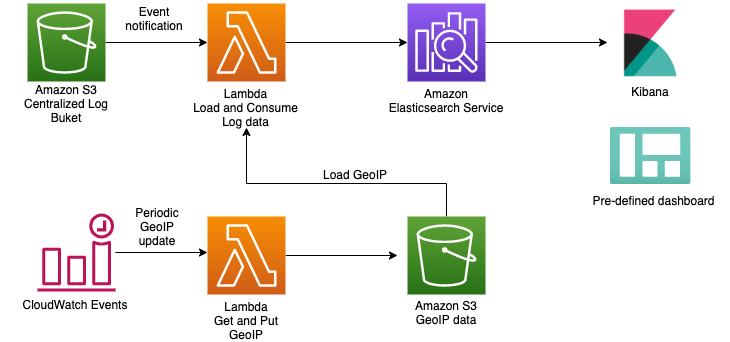

# Deploying SIEM with AWS CDK

language : [Eng](../README.md)

## Architecture


## Notices
* 이 모듈은 Centralized Log Bucket 으로 부터 트리거되는 SIEM on Amazon Elasticsearch Service 내용을 포함하고 있습니다.
* Log Source 구성을 위해서, [이 곳](configure_aws_service.md) 을 참고하여 원하는 AWS Services의 Log source 구성 방법을 확인합니다.
* 지원하는 Log Type 목록은 아래와 같습니다.

|       |AWS Service|Log|
|-------|-----------|---|
|Security, Identity, & Compliance|AWS Security Hub|Security Hub findings<br>GuardDuty findings<br>Amazon Macie findings<br>Amazon Inspector findings<br>AWS IAM Access Analyzer findings|
|Security, Identity, & Compliance|AWS WAF|AWS WAF Web ACL traffic information<br>AWS WAF Classic Web ACL traffic information|
|Security, Identity, & Compliance|Amazon GuardDuty|GuardDuty findings|
|Security, Identity, & Compliance|AWS Network Firewall|Flow logs<br>Alert logs|
|Management & Governance|AWS CloudTrail|CloudTrail Log Event|
|Networking & Content Delivery|Amazon CloudFront|Standard access log<br>Real-time log|
|Networking & Content Delivery|Amazon Route 53 Resolver|VPC DNS query log|
|Networking & Content Delivery|Amazon Virtual Private Cloud (Amazon VPC)|VPC Flow Logs (Version5)|
|Networking & Content Delivery|Elastic Load Balancing|Application Load Balancer access logs<br>Network Load Balancer access logs<br>Classic Load Balancer access logs|
|Storage|Amazon Simple Storage Service (Amazon S3)|access log|
|Database|Amazon Relational Database Service (Amazon RDS)<br>(**Experimental Support**)|Amazon Aurora(MySQL)<br>Amazon Aurora(PostgreSQL)<br>Amazon RDS for MariaDB<br>Amazon RDS for MySQL<br>Amazon RDS for PostgreSQL|
|Analytics|Amazon Managed Streaming for Apache Kafka (Amazon MSK)|Broker log|
|Compute|Linux OS<br>via CloudWatch Logs|/var/log/messages<br>/var/log/secure|
|Containers|Amazon Elastic Container Service (Amazon ECS)<br>via FireLens|Framework only|

Experimental Support: We may change field type, normalization and something in the future.


## 1. CDK 실행환경 구성

### 1.1. 로컬에서 구성하기
   ```shell
   git clone https://github.com/aws-samples/deploying-siem-with-aws-cdk.git
   cd deploying-siem-with-aws-cdk/
   npm install
   ```
### 1.2. EC2 로 CDK 실행환경 구성하기
cdk 로 배포할 때 20분이상 소요되므로 STS 의 만료시간이 15분인 경우, EC2를 이용하여 실행환경을 구성하는 방법을 권장합니다.

1. Amazon Linux 2 AMI 를 이용하여 EC2 를 시작합니다. (**t2.micro 이상**의 instance type을 선택합니다.)
1. Admin 권한을 가진 EC2 role 을 생성하여 attach 합니다.
1. EC2 에 접속합니다.
1. 아래 스크립트를 통해 필요한 모듈을 설치하고, 소스를 클론합니다.
   ```shell
    sudo yum groups mark install -y "Development Tools"
    sudo yum install -y amazon-linux-extras
    sudo amazon-linux-extras enable python3.8
    sudo yum install -y python38 python38-devel git jq
    sudo update-alternatives --install /usr/bin/python3 python3 /usr/bin/python3.8 1
    sudo update-alternatives --install /usr/bin/pip3 pip3 /usr/bin/pip3.8 1
    git clone https://github.com/aws-samples/deploying-siem-with-aws-cdk.git
   ```

## 2. Account ID 와 Region을 환경변수로 설정합니다.

```shell
export CDK_DEFAULT_ACCOUNT=<AWS_ACCOUNT> # your AWS account
export AWS_DEFAULT_REGION=<AWS_REGION> # region where the distributable is deployed
```
예)
```shell
export CDK_DEFAULT_ACCOUNT=888888888888
export AWS_DEFAULT_REGION=ap-northeast-2
```

## 3. Lambda 배포 패키지 생성

Amazon ES의 SIEM 에서 사용하는 Lambda 는 3rd party 라이브러리를 사용하고 있습니다.
아래 스크립트를 통해 이러한 라이브러리들을 다운로드하고, 로컬에 배포 패키지를 생성합니다.

```shell
cd deploying-siem-with-aws-cdk/deployment/
chmod +x ./step1-build-lambda-pkg.sh && ./step1-build-lambda-pkg.sh
```

## 4. CDK 환경 구성

아래의 스크립트는 aws-cdk 및 cdk를 실행하는데 필요한 소프트웨어들을 설치합니다.
로컬에서 진행하는 경우 Do you really continue? 가 노출되는데, 이때 y 를 입력하고 진행합니다.

```bash
chmod +x ./step2-setup-cdk-env.sh && ./step2-setup-cdk-env.sh
source ~/.bash_profile
```

## 5. CDK bootstrap

### 5-1. cdk.json 항목 내용 업데이트

아래의 내용을 참고하여, 필요한 항목을 변경할 수 있습니다.
s3_bucket_name 의 log, snapshot, geo 는 필수로 변경해야 하는 항목입니다.

| Parameter | Initial value | Description |
|------------|-------|-----|
| resource_suffix | [blank] | 재배포를 할 때 리소스의 중복을 방지하기 위한 suffix |
| aes_domain_name | aes-siem | Amazon Elasticsearch Service 에서 생성될 도메인이름 |
| s3_bucket_name | 생성될 3개의 S3 버킷이름: 아래의 [AWS Account ID]를 변경해야 합니다. |
| <font color="coral">*</font>log | aes-siem-<font color="coral">*[AWS Account ID]*</font>-log | 집중화된 로그들이 저장되는 버킷 |
| <font color="coral">*</font>snapshot | aes-siem-<font color="coral">*[AWS Account ID]*</font>-snapshot | kibana에서 import하는 ndjson가 저장되는 버킷 |
| <font color="coral">*</font>geo | aes-siem-<font color="coral">*[AWS Account ID]*</font>-geo | GeoIP 정보가 다운로드될 버킷 |
| kms_cmk_alias | aes-siem-key | 생성될 AWS KMS CMK(customer-managed key)의 alias 입력 |


### 5-2. json 파일 validation

아래 명령어로 json 파일을 확인합니다. 실행 후 json이 표시되고 오류가 없으면 정상입니다.

```shell
cdk context  --j
```

### 5-3. cdk bootstrap
```bash
cd ..
cdk bootstrap
```

* 에러가 발생하여 실행이 실패하는 경우, EC2 인스턴스가 Admin role 을 가지고 있는지 확인합니다.


## 6. CDK 배포
### 6-1. without GeoLite2
cdk 를 배포합니다.

```bash
cdk deploy
```
### 6-2. with GeoLite2 (optional)
Kibana에서 아래의 dashboard 에 나오는 것 처럼 Geo ip를 통해 국가 정보를 사용하고 싶다면, 아래 절차를 따릅니다.


1. 배포할 때 아래와 같이 GeoLite2LicenseKey 파라미터를 사용하여 LicenseKey를 입력합니다.
    ```bash
    cdk deploy --parameters GeoLite2LicenseKey=xxxxxxxxxxxxxxxx
    ```
1. 라이센스키는 [이 곳](https://dev.maxmind.com/geoip/geolite2-free-geolocation-data) 에서 생성합니다.
   * Sign Up for GeoLite2 -> Login -> Generate a License Key
1. 배포는 약 20분 정도 소요됩니다.
1. aes-siem-geoip-downloader lambda 테스트하기 (with GeoLite2)
    1. Lambda console 로 이동합니다.
    1. Test 탭으로 이동합니다.
    1. Test 버튼을 클릭합니다.
    1. S3 condole 로 이동하여 aes-siem-*[AWS Account ID]*-geo 버킷에 GeoLite2 폴더가 생성되었음을 확인합니다.

### 6-3. with AllowedSourceIpAddresses in Elasticsearch Service (optional)
   ```bash
   cdk deploy --parameters AllowedSourceIpAddresses="10.0.0.0/8 0.0.0.0" --parameters GeoLite2LicenseKey=xxxxxxxxxxxxxxxx
   ```
## 7. ES Access policy 수정
1. Elasticsearch Service console 로 이동합니다.
1. aes-siem 도메인 > Actions > Modify access policy 를 선택합니다.
1. aws:SourceIp 에 허용할 목록을 지정합니다.

## 8. Kibana 접속
1. 배포한 CloudFormation 의 Outputs 탭을 확인합니다.
1. KibanaUrl 에 접속합니다. (8번에서 지정한 sourceIp에서만 접근 가능)
1. KibanaAdmin/KibanaPassword 로 로그인합니다.
   * KibanaAdmin/KibanaPassword로 로그인 되지 않는 경우는, Elasticsearch Service console 에 aes-siem 도메인 > Actions > Modify authentication 으로 master user 를 생성합니다.
1. Select your tenant는 Global을 선택합니다.
1. Dashboard 메뉴를 선택합니다. 서비스별로 대쉬보드가 구성되어 있는 것을 확인합니다.
   * 6-1 without GeoLite2로 진행한 경우, 각 대쉬보드에 Geo 관련 Panel 의 데이터는 보이지 않는 것이 정상입니다.
   
## 9. Cleanup
1. CloudFormation console 로 이동하여 delete stack 을 수행합니다.
1. 아래 자원은 각각 서비스의 console 로 이동하여 삭제해야 합니다.
   * Amazon ES domain: aes-siem<font color="grey">{resource_suffix}</font>
   * Amazon S3 bucket: aes-siem-[AWS_Account]-log<font color="grey">{resource_suffix}</font>
   * Amazon S3 bucket: aes-siem-[AWS_Account]-snapshot<font color="grey">{resource_suffix}</font>
   * Amazon S3 bucket: aes-siem-[AWS_Account]-geo<font color="grey">{resource_suffix}</font>
   * AWS KMS customer-managed key: aes-siem-key<font color="grey">{resource_suffix}</font>
     - <font color="coral">**주의**</font>: CMK(customer-managed key)를 삭제하게 되면 이 키를 이용해 암호화했던 로그를 읽을 수 없게 됩니다.
   
## 10. Redeploy
* 이 스택을 <font color="coral">재배포</font>하려면, **cdk.json** 의 **resource_suffix** 항목의 값을 수정한 후 6번을 진행합니다.

## License
This product uses GeoLite2 Data created by MaxMind and is licensed under https://www.maxmind.com/en/geolite2/eula incorporating CC-BY-SA, available from https://www.maxmind.com.
This product uses ndjson and is licensed under BSD-3-Clause, available from http://ndjson.org/
